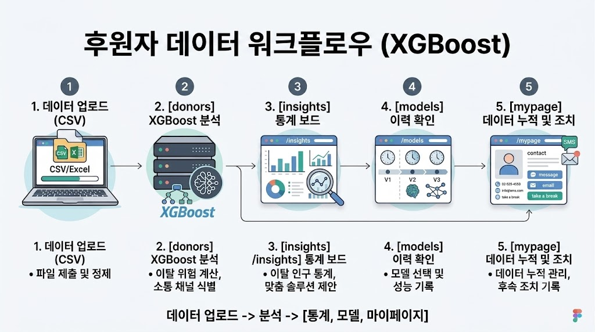
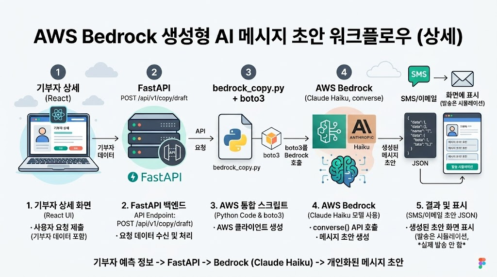

<p align="center">
  
</p>

<h1 align="center">두잎 (Doeep)</h1>

<p align="center">
  <b>정기후원자 이탈 예측 & 리텐션 대시보드</b>
</p>

<p align="center">
  정기후원자의 이탈 확률을 예측하고,<br />
  위험군별 맞춤 채널 · 메시지 · 솔루션까지 한 번에 제안하는<br />
  비영리단체용 CRM 대시보드
</p>

<p align="center">
  <a href="https://doeep.vercel.app/"></a>
  &nbsp;
  <a href="#"></a>
  &nbsp;
  <a href="#"></a>
</p>

---

<p align="center">
  <a href="data/01_데이터_전처리_결과서.md">데이터 전처리 결과서</a>
  &nbsp;·&nbsp;
  <a href="data/02_모델_학습결과서.md">모델 학습결과서</a>
  &nbsp;·&nbsp;
  <a href="data/03_모델_메타데이터.md">모델 메타데이터</a>
</p>

<h2 align="center">목차</h2>

<p align="center">
  <a href="#팀-소개">팀 소개</a>
  &nbsp;·&nbsp;
  <a href="#프로젝트-개요">프로젝트 개요</a>
  &nbsp;·&nbsp;
  <a href="#-wbs--개발-일정">WBS & 개발 일정</a>
  &nbsp;·&nbsp;
  <a href="#개발-배경">개발 배경</a>
  &nbsp;·&nbsp;
  <a href="#핵심-기능">핵심 기능</a>
  <br />
  <a href="#기술-스택">기술 스택</a>
  &nbsp;·&nbsp;
  <a href="#시스템-아키텍처">시스템 아키텍처</a>
  &nbsp;·&nbsp;
  <a href="#핵심-기술-상세">핵심 기술 상세</a>
  &nbsp;·&nbsp;
  <a href="#프로젝트-구조">프로젝트 구조</a>
  &nbsp;·&nbsp;
  <a href="#실행-방법">실행 방법</a>
  &nbsp;·&nbsp;
  <a href="#향후-계획--회고">향후 계획 & 회고</a>
</p>

---

<h2 align="center">팀 소개</h2>

<div align="center">

<table>
<colgroup>
<col width="20%"><col width="20%"><col width="20%"><col width="20%"><col width="20%">
</colgroup>
<tr>
<td align="center"></td>
<td align="center"></td>
<td align="center"></td>
<td align="center"></td>
<td align="center"></td>
</tr>
<tr>
<td align="center"><b>황호순 (팀장)</b></td>
<td align="center"><b>김대호</b></td>
<td align="center"><b>김진화</b></td>
<td align="center"><b>채정석</b></td>
<td align="center"><b>홍지윤</b></td>
</tr>
<tr>
<td align="center">
  <a href="https://github.com/Amber8800">
    
  </a>
</td>
<td align="center">
  <a href="https://github.com/jjhok6389">
    
  </a>
</td>
<td align="center">
  <a href="https://github.com/masquerade0425-hash">
    
  </a>
</td>
<td align="center">
  <a href="https://github.com/qnfdhk-rgb">
    
  </a>
</td>
<td align="center">
  <a href="https://github.com/JiYoon241111">
    
  </a>
</td>
</tr>
</table>

</div>

<h3 align="center">담당 기능</h3>

<div align="center">

| 이름 | 담당 기능 |
|:---:|:---|
| 황호순 | PM , 데이터 전처리 , 머신러닝 모델 학습 , 모델 히스토리 페이지 , 문서 작성 |
| 김대호 | 프로토타입·배포(Docker/Railway), 기부자 관리(배치 예측·후속조치), AWS Bedrock AI 메시지 구현, ML 백엔드 |
| 김진화 | 이탈 데이터 시각화, 기능 정상 작동 검증(일부), 데이터 탐색적 분석(초기) |
| 채정석 | 예측 결과 기반 통계·솔루션 페이지 개발, README 작성·문서화 |
| 홍지윤 | 사용자 인증(이메일·Google·Kakao), Firestore 기반 마이페이지·기부자 명단·활동 기록 |

</div>


## 프로젝트 개요

| 항목 | 내용 |
|---|---|
| 프로젝트명 | 두잎 (Doeep) |
| 개발 기간 | 2026.07.21(화) ~ 2026.08.06(목) |
| 한 줄 소개 | CSV/Excel로 후원자 명단을 올리면, 학습된 XGBoost 모델이 이탈 확률을 계산하고<br/>위험군별로 어떤 채널·메시지로 다시 연락하면 좋을지까지 제안하는 대시보드 |

### 서비스 흐름

<p align="center">
  
</p>

---

## 📅 WBS & 개발 일정

> 기간: **2026.07.21(화) ~ 2026.08.06(목)**

| 구분 | 작업 (Jira) | 7/21<br/>~7/23 | 7/24<br/>~7/26 | 7/27<br/>~7/29 | 7/30<br/>~8/1 | 8/2<br/>~8/4 | 8/5<br/>~8/6 |
|------|-------------|:---:|:---:|:---:|:---:|:---:|:---:|
| 🌐 **웹 기반** | 기본 웹페이지 `(MLP-2)` | 🟦 | 🟦 | ⬜ | ⬜ | ⬜ | ⬜ |
| | 메인 페이지 `(MLP-5)` | ⬜ | 🟦 | 🟦 | 🟦 | ⬜ | ⬜ |
| 🤖 **데이터·ML** | 데이터 전처리 `(MLP-10)` | 🟦 | 🟦 | ⬜ | ⬜ | ⬜ | ⬜ |
| | 머신러닝 모델 만들기 `(MLP-3)` | 🟦 | 🟦 | 🟦 | ⬜ | ⬜ | ⬜ |
| | 웹페이지 모델 연동 `(MLP-1)` | ⬜ | ⬜ | 🟦 | 🟦 | ⬜ | ⬜ |
| 🔐 **인증·회원** | 로그인/회원가입 `(MLP-4)` | ⬜ | 🟦 | 🟦 | ⬜ | ⬜ | ⬜ |
| | 로그인 DB 구축 `(MLP-12)` | ⬜ | 🟦 | 🟦 | ⬜ | ⬜ | ⬜ |
| | 마이페이지 `(MLP-13)` | ⬜ | ⬜ | 🟦 | 🟦 | 🟦 | ⬜ |
| 📊 **기능 페이지** | 모델 성능평가 `(MLP-6)` | ⬜ | ⬜ | 🟦 | 🟦 | 🟦 | ⬜ |
| | 시각화 페이지 `(MLP-7)` | ⬜ | ⬜ | 🟦 | 🟦 | 🟦 | ⬜ |
| | 솔루션 페이지 `(MLP-8)` | ⬜ | ⬜ | 🟦 | 🟦 | 🟦 | ⬜ |
| 🚀 **통합·배포** | 브랜치 통합 `(MLP-15)` | ⬜ | ⬜ | ⬜ | 🟦 | 🟦 | 🟦 |
| | README 제작 `(MLP-9)` | ⬜ | ⬜ | ⬜ | ⬜ | 🟦 | 🟦 |
| | 최종 배포 `(MLP-11)` | ⬜ | ⬜ | ⬜ | ⬜ | 🟦 | 🟦 |

**범례:** 🟦 진행 · ⬜ 미진행

---

## 개발 배경

- 정기후원(기부) 단체는 신규 후원자를 모으는 것 못지않게 **기존 후원자의 이탈을 막는 것**이 중요하지만,<br/>실무에서는 "누가 이탈 위험이 높은지"를 데이터로 미리 알기 어렵고,<br/>안다고 해도 담당자가 후원자 한 명 한 명에게 어떤 채널·메시지로 연락할지 판단하는 데 시간이 많이 듭니다.
- 이를 위해 아름다운재단 기부문화연구소의 **기빙코리아 2024 / GK2022 개인기부자 조사** 데이터를 학습에 활용해,<br/>연령·소득·기부 경로 등 후원자 특성으로부터 이탈 확률을 예측하는 모델을 만들었습니다.
- 여기서 그치지 않고, 예측된 위험도를 **인구통계별 통계·맞춤 솔루션·AI 개인화 메시지 초안**까지<br/>이어지는 실무 워크플로로 확장한 것이 이 프로젝트의 차별점입니다.

---

## 핵심 기능

| 기능 | 설명 | 핵심 기술 |
|---|---|---|
| 일괄 이탈 예측 | CSV/Excel 업로드 → 후원자별 이탈 확률·위험도(High/Medium/Low)·추천 연락 채널 산출 | FastAPI, XGBoost, pandas |
| AI 개인화 아웃리치 초안 | 위험도·추천 채널·프로필을 근거로 SMS/이메일 초안 자동 생성 | AWS Bedrock<br/>(Claude Haiku 4.5) |
| 인구통계별 이탈 통계 · 솔루션 | 연령대·성별·학력·종교·고용상태·자녀유무·소득구간·혼인상태<br/>8개 축 이탈율 시각화, 축 클릭 시 맞춤 솔루션 모달 | React, Recharts |
| 전체 리포트 PDF 출력 | 통계·솔루션 화면을 PDF 리포트로 저장 | html-to-image, jsPDF |
| 모델 히스토리 | Random Forest·Logistic Regression·Gradient Boosting·XGBoost·CatBoost·MLP<br/>6개 모델의 성능·혼동행렬 비교와 최종 선택 근거 제공 | Recharts |
| 기부자 명단 · 후속 조치 관리 | 예측 결과를 마이페이지 명단에 누적 저장<br/>문자/이메일·쉬어가기 등 조치 이력 기록 | Firebase Firestore |
| 로그인 · 회원가입 | 이메일/비밀번호 및 Google·Kakao 소셜 로그인 | Firebase Authentication,<br/>Kakao SDK |

---

## 기술 스택

### Frontend

| 분류 | 기술 |
|---|---|
| 프레임워크 |  |
| 빌드 도구 |  |
| 라우팅 |  |
| 스타일링 |  |
| 차트 |  |
| 아이콘 |  |
| PDF/이미지 |   |
| 린터 |  |

### Backend / API

| 분류 | 기술 |
|---|---|
| 프레임워크 |  |
| ASGI 서버 |  |
| 스키마/검증 |  |
| 환경변수 |  |
| 파일 업로드 |  |

### ML / 데이터

| 분류 | 기술 |
|---|---|
| 운영 모델 |  |
| 모델 직렬화 |  |
| 데이터 처리 |    |
| ML 라이브러리 |   |
| 비교·실험 모델 |      |

### 인증 / 데이터 저장

| 분류 | 기술 |
|---|---|
| Auth + DB |   |
| 소셜 로그인 |   |

### 외부 서비스 / 인프라

| 분류 | 기술 |
|---|---|
| LLM 카피 생성 |   |
| 컨테이너 |  |
| 백엔드 배포 |  |
| 프론트 배포 |  |

### 협업 / 프로젝트 관리

| 분류 | 도구 |
|---|---|
| 버전 관리 · PR |  |
| 이슈 트래킹 |  |

---

## 시스템 아키텍처


- **Frontend**: [https://doeep.vercel.app/](https://doeep.vercel.app/) (Vercel)
- **Backend**: Railway (`Dockerfile` + `railway.toml`, `/health`로 헬스체크)

---

## 핵심 기술 상세

### AI 개인화 아웃리치 초안

위험도·추천 채널·후원자 프로필(연락처 제외)을 근거로 AWS Bedrock(Claude Haiku 4.5)에 프롬프트를 보내<br/>
SMS·이메일 초안을 생성합니다. 시스템 프롬프트에 호칭 규칙, 채널별 톤, 위험도별 긴급도, 출력 JSON 스키마를 명시해,<br/>
담당자가 초안을 바로 검토·발송할 수 있는 수준의 결과를 받도록 설계했습니다.

<p align="center">
  
</p>

**흐름:** 기부자 상세(React) → `POST /api/v1/copy/draft` (FastAPI) → `bedrock_copy.py` + boto3<br/>
→ AWS Bedrock (`converse`) → SMS/이메일 초안 JSON → 화면 표시 (발송은 시뮬레이션, 실제 발송 안 함)

---

## 프로젝트 구조

```
SKN34-2nd-6Team/
├─ donor-churn-dashboard/        # React 프론트엔드 (Vite + Tailwind, Vercel 배포)
│  └─ src/
│     ├─ pages/                  # DonorsPage, InsightsPage, ModelsPage, MyPage, HomePage …
│     ├─ components/
│     │  ├─ donors/              # 배치 예측 · 결과 테이블 · 후속 조치
│     │  ├─ insights/            # 인구통계 이탈 통계 · 솔루션
│     │  ├─ models/              # 모델 비교 · 히스토리
│     │  ├─ home/                # 랜딩 페이지 전용 컴포넌트
│     │  └─ layout/, common/
│     ├─ services/               # api.js, firebase.js, donorRosterDb.js 등
│     ├─ context/AuthContext.jsx
│     └─ data/                   # featureLinks.js, inferenceFields.js
├─ ml-backend/                   # FastAPI 예측/카피 생성 API (Railway 배포)
│  └─ app/
│     ├─ api/routes.py
│     └─ services/               # column_map, preprocess, predict, bedrock_copy
├─ ML/                           # 학습된 XGBoost 모델 (XGBoost_model_v2.joblib)
├─ data/                         # 학습용 원본 엑셀 데이터 샘플
├─ docs/                         # 시스템 아키텍처 · 커밋 컨벤션 등
├─ Dockerfile / railway.toml     # 백엔드 Railway 배포 설정
├─ requirements.txt              # 백엔드 의존성 (루트 단일)
├─ .env.example                  # 환경변수 템플릿 (프론트/백엔드 공유)
├─ setup.ps1 / setup.sh
├─ run-backend.ps1 / run-backend.sh
└─ structure.md                  # 팀 구현 가이드
```

> 옛 경로 `/daeho`, `/jeongseok`, `/hosun`, `/jiyun` 은 각각 `/donors`, `/insights`, `/models`, `/mypage` 로 리다이렉트됩니다.

---

## 실행 방법

```powershell
# 1) 환경 변수 설정 (레포 루트)
cp .env.example .env
# .env에 Firebase / Kakao / AWS Bedrock 키 입력

# 2) ML API (레포 루트에서, 최초 1회)
.\setup.ps1          # .venv 생성 + requirements 설치
.\run-backend.ps1    # http://127.0.0.1:8000 (Swagger: /docs)

# 3) 프론트엔드
cd donor-churn-dashboard
npm install
npm run dev           # http://localhost:5173
```

macOS/Linux는 `./setup.sh`, `./run-backend.sh`를 사용하세요.

### 배포

- **프론트엔드**: [Vercel](https://doeep.vercel.app/) — `donor-churn-dashboard` 배포
- **백엔드**: Railway — 루트 `Dockerfile`로 이미지 빌드 (`railway.toml` 참고), `/health` 헬스체크
- CORS는 `ml-backend/app/main.py`에서 `https://doeep.vercel.app`을 기본 허용하며, `CORS_ORIGINS` 환경변수로 추가할 수 있습니다.

---

## 향후 계획 & 회고

### 향후 계획

| # | 계획 |
|---|---|
| 1 | 관리자(운영자) 중심 구성에서 나아가,<br/>실제 후원자(소비자) 입장에서 이용할 수 있는 페이지 제작 |
| 2 | 요금제 설명 페이지 추가 (구독 플랜 안내) |
| 3 | 추천 액션 효과 검증 — 문자/이메일 등 조치 이후 재후원 여부를 추적해<br/>예측·솔루션 신뢰도를 측정하는 폐루프 구축 |
| 4 | 개인정보 보호·권한 관리 강화 — 역할별 접근 권한 분리,<br/>민감정보 마스킹/접근 로그 추가 |

### 팀원별 회고

| 이름 | 회고 |
|---|---|
| 황호순 | 팀장으로서 프로젝트를 이끌면서 브랜치 관리가 생각보다 매끄럽지 않았던 점이 아쉽지만,<br/>팀원들이 잘 따라와 주시고 소통이 잘되어 비교적 원만하게 마무리할 수 있었습니다. |
| 김대호 | 서로 다른 전공을 가진 팀원들과 진행하며 협업의 가치를 깊이 느꼈습니다.<br/>각자의 전문 지식을 결합하는 힘이 강력했고, 사전 계획 덕분에 일정을 원활히 소화할 수 있었습니다.<br/>특히 내용을 설명·공유하는 과정이 스스로의 지식을 정리하는 데 큰 도움이 되었습니다. |
| 김진화 | 각자 페이지를 따로 만드는 프로세스에서 브랜치 관리·통합이 중요했고, 시행착오를 통해 많이 배웠습니다.<br/>프론트엔드 경험이 거의 없었는데 프레임워크를 다루며 인상적인 경험을 쌓았습니다. |
| 채정석 | 주제가 빠르게 정해진 덕분에 신속히 진행할 수 있었습니다.<br/>비전공자로서 부족한 부분을 팀원들이 채워 주었고, 함께 학습하며 성장할 수 있었습니다.<br/>이탈 예측을 비즈니스 모델로 연결해 본 과정이 값진 경험이었습니다. |
| 홍지윤 | 팀원들의 도움으로 기능을 구현할 수 있었고,<br/>카카오 로그인 권한 신청 이슈는 계정 ID 로그인으로 우회해 해결했습니다.<br/>정보 공유 덕분에 다양한 연동 방식을 빠르게 익혀 마무리할 수 있었습니다. |
