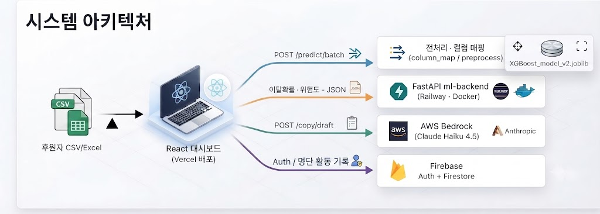

<p align="center">
  
</p>

<h1 align="center">두잎 (Doeep)</h1>

<p align="center">
  <b>정기후원자 이탈 예측 & 리텐션 대시보드</b>
</p>

<p align="center">
  정기후원자의 이탈 확률을 예측하고,<br />
  위험군별 맞춤 채널 · 메시지 · 솔루션까지 한 번에 제안하는<br />
  비영리단체용 CRM 대시보드
</p>

<p align="center">
  <a href="https://doeep.vercel.app/"></a>
  &nbsp;
  <a href="#"></a>
  &nbsp;
  <a href="#"></a>
</p>

---

## 목차

<p align="center">

[팀 소개](#팀-소개)
&nbsp;·&nbsp;
[프로젝트 개요](#프로젝트-개요)
&nbsp;·&nbsp;
[개발 배경](#개발-배경)
&nbsp;·&nbsp;
[핵심 기능](#핵심-기능)
&nbsp;·&nbsp;
[기술 스택](#기술-스택)

<br />

[시스템 아키텍처](#시스템-아키텍처)
&nbsp;·&nbsp;
[핵심 기술 상세](#핵심-기술-상세)
&nbsp;·&nbsp;
[프로젝트 구조](#프로젝트-구조)
&nbsp;·&nbsp;
[실행 방법](#실행-방법)
&nbsp;·&nbsp;
[향후 계획 & 회고](#향후-계획--회고)

</p>

---
## 팀 소개

<table>
<colgroup>
<col width="20%"><col width="20%"><col width="20%"><col width="20%"><col width="20%">
</colgroup>
<tr>
<td align="center"></td>
<td align="center"></td>
<td align="center"></td>
<td align="center"></td>
<td align="center"></td>
</tr>
<tr>
<td align="center"><b>황호순(팀장)</b></td>
<td align="center"><b>김대호</b></td>
<td align="center"><b>김진화</b></td>
<td align="center"><b>채정석</b></td>
<td align="center"><b>홍지윤</b></td>
</tr>
<tr>
<td align="center"><a href="https://github.com/Amber8800">@Amber8800</a></td>
<td align="center"><a href="https://github.com/kimdaeho">@kimdaeho</a></td>
<td align="center"><a href="https://github.com/masquerade0425-hash">@masquerade0425-hash</a></td>
<td align="center"><a href="https://github.com/qnfdhk-rgb">@qnfdhk-rgb</a></td>
<td align="center"><a href="https://github.com/JiYoon241111">@JiYoon241111</a></td>
</tr>
</table>

### 담당 기능

| 이름 | 담당 기능 |
|---|---|
| 황호순 | PM / 데이터 전처리 / 머신러닝 모델 학습 / 모델 히스토리 페이지 담당 / 문서 작성 |
| 김대호 | 프로토타입·배포(Docker/Railway), 기부자 관리(배치 예측·후속조치), AWS Bedrock AI 메시지 구현, ML 백엔드 |
| 김진화 | 이탈 데이터 시각화 (별도 브랜치에서 작업 중, main 미병합) |
| 채정석 | 예측 결과 기반 통계 시각화 및 솔루션 제안 페이지 개발, 프로젝트 README 작성 및 문서화 |
| 홍지윤 | 사용자 인증(이메일·Google·Kakao) 및 Firestore 기반 마이페이지·기부자 명단·활동 기록 |

## 프로젝트 개요

- **프로젝트명**: 두잎(Doeep)
- **개발 기간**: 2026.07.21(화) ~ 2026.08.06(목)<!-- TODO(팀): 예) 2026.06.30 ~ 2026.08.05 -->
- **한 줄 소개**: CSV/Excel로 후원자 명단을 올리면, 학습된 XGBoost 모델이 이탈 확률을 계산하고 위험군별로 어떤 채널·메시지로 다시 연락하면 좋을지까지 제안하는 대시보드입니다.

### 서비스 흐름

```
후원자 명단(CSV/Excel) 업로드
        │
        ▼
[기부자 관리 /donors] 이탈 확률·위험도·추천 채널 계산 (XGBoost)
        │
        ├─► [통계 및 솔루션 /insights] 인구통계별 이탈 통계 + 세그먼트 맞춤 솔루션
        ├─► [모델 히스토리 /models] 어떤 모델을 왜 선택했는지 확인
        └─► [마이페이지 /mypage] 후원자 명단 누적 관리 + 후속 조치(문자/이메일/쉬어가기) 기록
```

## 개발 배경

- 정기후원(기부) 단체는 신규 후원자를 모으는 것 못지않게 **기존 후원자의 이탈을 막는 것**이 중요하지만, 실무에서는 "누가 이탈 위험이 높은지"를 데이터로 미리 알기 어렵고, 안다고 해도 담당자가 후원자 한 명 한 명에게 어떤 채널·메시지로 연락할지 판단하는 데 시간이 많이 듭니다.
- 이를 위해 아름다운재단 기부문화연구소의 **기빙코리아 2024 / GK2022 개인기부자 조사** 데이터를 학습에 활용해, 연령·소득·기부 경로 등 후원자 특성으로부터 이탈 확률을 예측하는 모델을 만들었습니다.
- 여기서 그치지 않고, 예측된 위험도를 **인구통계별 통계·맞춤 솔루션·AI 개인화 메시지 초안**까지 이어지는 실무 워크플로로 확장한 것이 이 프로젝트의 차별점입니다.

<!-- TODO(팀): 실제 리서치/설문 등 팀이 조사한 문제 인식 근거가 있다면 여기에 보강 -->

## 핵심 기능

| 기능 | 설명 | 핵심 기술 |
|---|---|---|
| 일괄 이탈 예측 | CSV/Excel 업로드 → 후원자별 이탈 확률·위험도(High/Medium/Low)·추천 연락 채널 산출 | FastAPI, XGBoost, pandas |
| AI 개인화 아웃리치 초안 | 위험도·추천 채널·프로필을 근거로 SMS/이메일 초안을 자동 생성 | AWS Bedrock (Claude Haiku 4.5) |
| 인구통계별 이탈 통계 · 솔루션 | 연령대·성별·학력·종교·고용상태·자녀유무·소득구간·혼인상태 8개 축 이탈율 시각화, 축 클릭 시 맞춤 솔루션 모달 | React, Recharts |
| 전체 리포트 PDF 출력 | 통계·솔루션 화면을 PDF 리포트로 저장 | html-to-image, jsPDF |
| 모델 히스토리 | Random Forest·Logistic Regression·Gradient Boosting·XGBoost·CatBoost·MLP 6개 모델의 성능·혼동행렬 비교와 최종 선택 근거 제공 | Recharts |
| 기부자 명단 · 후속 조치 관리 | 예측 결과를 마이페이지 명단에 누적 저장, 문자/이메일 발송·쉬어가기 제안 등 조치 이력 기록 | Firebase Firestore |
| 로그인 | 이메일/비밀번호 및 카카오 로그인 지원 | Firebase Authentication, Kakao SDK |

## 기술 스택

### Frontend
| 분류 | 기술 |
|---|---|
| 프레임워크 |  |
| 빌드 도구 |  |
| 라우팅 |  |
| 스타일링 |  |
| 차트 |  |
| 아이콘 |  |
| PDF/이미지 |   |
| 린터 |  |

### Backend / API
| 분류 | 기술 |
|---|---|
| 프레임워크 |  |
| ASGI 서버 |  |
| 스키마/검증 |  |
| 환경변수 |  |
| 파일 업로드 |  |

### ML / 데이터
| 분류 | 기술 |
|---|---|
| 운영 모델 |   |
| 모델 직렬화 |  |
| 데이터 처리 |    |
| ML 라이브러리 |   |
| 비교·실험 모델 |      |

### 인증 / 데이터 저장
| 분류 | 기술 |
|---|---|
| Auth + DB |   |
| 소셜 로그인 |   |

### 외부 서비스 / 인프라
| 분류 | 기술 |
|---|---|
| LLM 카피 생성 |   |
| 컨테이너 |  |
| 백엔드 배포 |  |
| 프론트 배포 |  |

### 협업 / 프로젝트 관리
| 분류 | 도구 |
|---|---|
| 버전 관리 · PR |  |
| 이슈 트래킹 |  |


## 시스템 아키텍처



- **Frontend**: [https://doeep.vercel.app/](https://doeep.vercel.app/) (Vercel)
- **Backend**: Railway (`Dockerfile` + `railway.toml`, `/health`로 헬스체크)

## 핵심 기술 상세

### AI 개인화 아웃리치 초안

위험도·추천 채널·후원자 프로필(연락처 제외)을 근거로 AWS Bedrock(Claude Haiku 4.5)에 프롬프트를 보내 SMS·이메일 초안을 생성합니다. 시스템 프롬프트에 호칭 규칙, 채널별 톤, 위험도별 긴급도, 출력 JSON 스키마를 명시해, 담당자가 초안을 바로 검토·발송할 수 있는 수준의 결과를 받도록 설계했습니다.

## 프로젝트 구조

```
SKN34-2nd-6Team/
├─ donor-churn-dashboard/        # React 프론트엔드 (Vite + Tailwind, Vercel 배포)
│  └─ src/
│     ├─ pages/                  # DonorsPage, InsightsPage, ModelsPage, MyPage, HomePage …
│     ├─ components/
│     │  ├─ donors/               # 배치 예측 · 결과 테이블 · 후속 조치 (구 daeho)
│     │  ├─ insights/              # 인구통계 이탈 통계 · 솔루션 (구 jeongseok)
│     │  ├─ models/                # 모델 비교 · 히스토리 (구 hosun)
│     │  ├─ home/                  # 랜딩 페이지 전용 컴포넌트
│     │  └─ layout/, common/
│     ├─ services/                # api.js, firebase.js, donorRosterDb.js 등
│     ├─ context/AuthContext.jsx
│     └─ data/                   # featureLinks.js, inferenceFields.js
├─ ml-backend/                   # FastAPI 예측/카피 생성 API (Railway 배포)
│  └─ app/
│     ├─ api/routes.py
│     └─ services/                # column_map.py, preprocess.py, predict.py, bedrock_copy.py
├─ ML/                            # 학습된 XGBoost 모델 (XGBoost_model_v2.joblib)
├─ data/                          # 학습용 원본 엑셀 데이터 샘플
├─ docs/                          # 브랜치·커밋 컨벤션 가이드
├─ Dockerfile / railway.toml      # 백엔드 Railway 배포 설정
├─ requirements.txt               # 백엔드 의존성 (루트 단일)
├─ .env.example                   # 환경변수 템플릿 (루트 단일, 프론트/백엔드 공유)
├─ setup.ps1 / setup.sh
├─ run-backend.ps1 / run-backend.sh
└─ structure.md                   # 팀 구현 가이드
```

> `/daeho`, `/jeongseok`, `/hosun`, `/jiyun` 등 옛 경로는 각각 `/donors`, `/insights`, `/models`, `/mypage`로 리다이렉트됩니다 (`App.jsx`).

## 실행 방법

```powershell
# 1) 환경 변수 설정 (레포 루트)
cp .env.example .env
# .env에 Firebase / Kakao / AWS Bedrock 키 입력

# 2) ML API (레포 루트에서, 최초 1회)
.\setup.ps1          # .venv 생성 + requirements 설치
.\run-backend.ps1    # http://127.0.0.1:8000 (Swagger: /docs)

# 3) 프론트엔드
cd donor-churn-dashboard
npm install
npm run dev           # http://localhost:5173
```

macOS/Linux는 `./setup.sh`, `./run-backend.sh`를 사용하세요.

### 배포

- **프론트엔드**: [Vercel](https://doeep.vercel.app/) — `donor-churn-dashboard`를 정적/서버리스로 배포
- **백엔드**: Railway — 루트 `Dockerfile`로 이미지를 빌드해 배포 (`railway.toml` 참고), `/health`로 헬스체크
- CORS는 `ml-backend/app/main.py`에서 `https://doeep.vercel.app`을 기본 허용 오리진으로 등록해 두었고, 필요 시 `CORS_ORIGINS` 환경변수로 추가할 수 있습니다.

## 향후 계획 & 회고

### 향후 계획

| # | 계획 |
|---|---|
| 1 | 관리자(운영자) 중심의 현재 페이지 구성에서 나아가, 실제 후원자(소비자) 입장에서 이용할 수 있는 페이지 제작 |
| 2 | 요금제 설명 페이지 추가 (구독 플랜 안내) |
| 3 | 추천 액션의 효과 검증 — 문자/이메일 발송 등 조치 이후 실제 재후원 여부를 추적해 예측·솔루션의 신뢰도를 측정하는 폐루프 구축 |
| 4 | 개인정보 보호·권한 관리 강화 — 운영자 역할별 접근 권한 분리, 연락처·소득 등 민감정보 마스킹/접근 로그 추가 |

### 팀원별 회고

| 이름 | 회고 |
|---|---|
| 황호순 | 팀장으로서 프로젝트를 이끌면서 브랜치 관리가 생각했던것보다 매끄럽게 되지 않았던점이 아쉽지만 팀원분들이 잘 따라와 주시고 소통이 잘되어 트러블이 적어 비교적 원만하게 프로젝트를 마무리 할 수 있었습니다. |
| 김대호 | <!-- TODO(팀): 한마디 추가 --> |
| 김진화 | <!-- TODO(팀): 한마디 추가 --> |
| 채정석 | 주제가 빠르게 정해진 덕분에 프로젝트를 신속하게 진행할 수 있었습니다. 각자 맡은 부분을 진행하는 과정에서 비전공자로서 부족했던 부분을 팀원들이 채워주었고, 그 과정에서 함께 학습하며 성장할 수 있었던 좋은 기회였습니다. 특히 '기부자 이탈 관리'라는 흥미로운 주제를 머신러닝으로 학습시켜 이탈 가능성이 높은 대상을 예측하고, 이를 바탕으로 소비자와 관리자 양쪽 입장에서 활용 가능한 비즈니스 모델로 연결해본 과정과 결과는 값진 경험이었습니다. |
| 홍지윤 | 팀원들의 도움으로 기능구현을 수행할 수 있었고, 카카오 로그인 권한 신청 과정에서 이슈가 발생했으나, 단순 계정 ID 로그인 방식으로 유연하게 우회하여 트러블을 해결했습니다. 팀원들의 정보 공유와 도움 덕분에 다양한 연동 방식을 빠르게 익혀 마무리할 수 있었습니다. |
