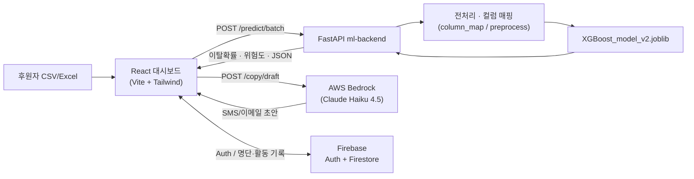

# 두잎(Doeep) — 정기후원자 이탈 예측 & 리텐션 대시보드

> 정기후원자의 이탈 확률을 예측하고, 위험군별 맞춤 채널·메시지·솔루션까지 한 번에 제안하는 비영리단체용 CRM 대시보드
>
> <!-- TODO(팀): 한 줄 소개는 팀 합의 후 최종 문구로 다듬어 주세요 -->

[배포 링크](#) · [시연 영상](#) · [발표 자료](#)

<!-- TODO(팀): 실제 배포 URL / 영상 / 발표자료 링크로 교체 -->

## 📚 목차
- [팀 소개](#팀-소개)
- [프로젝트 개요](#프로젝트-개요)
- [개발 배경](#개발-배경)
- [핵심 기능](#핵심-기능)
- [기술 스택](#기술-스택)
- [시스템 아키텍처](#시스템-아키텍처)
- [핵심 기술 상세](#핵심-기술-상세)
- [프로젝트 구조](#프로젝트-구조)
- [실행 방법](#실행-방법)
- [향후 계획 & 회고](#향후-계획--회고)

## 팀 소개

| 이름 | 담당 페이지 | 담당 기능 | GitHub |
|---|---|---|---|
| 김대호 | `/daeho` 기부자 관리 | 배치 이탈 예측 UI, 결과 테이블·상세 Drawer, 기부자 명단(Firestore) 연동 | [@kimdaeho](https://github.com/kimdaeho) |
| 황호순 | `/hosun` 모델 히스토리 | 모델 비교·평가 시각화(혼동행렬, 정확도 비교), 브랜드 로고/파비콘 정리 | [@Amber8800](https://github.com/Amber8800) |
| 김진화 | `/jinhwa` 데이터 시각화 | 이탈 데이터 시각화 (진행 중) | [@masquerade0425-hash](https://github.com/masquerade0425-hash) |
| 채정석 | `/jeongseok` 통계 및 솔루션 | 인구통계 8개 축 이탈 통계, 위험군별 맞춤 솔루션, PDF 리포트 | [@qnfdhk-rgb](https://github.com/qnfdhk-rgb) |
| 홍지윤 | `/jiyun` 마이페이지 | Firebase/Kakao 로그인, Firestore 기반 기부자 명단·활동 기록 | [@JiYoon241111](https://github.com/JiYoon241111) |

<!-- TODO(팀): "담당 기능" 표현과 세부 역할(PM 여부 등)은 팀원 확인 후 다듬어 주세요 -->

## 프로젝트 개요

- **프로젝트명**: 두잎(Doeep)
- **개발 기간**: <!-- TODO(팀): 예) 2026.06.30 ~ 2026.08.05 -->
- **한 줄 소개**: CSV/Excel로 후원자 명단을 올리면, 학습된 XGBoost 모델이 이탈 확률을 계산하고 위험군별로 어떤 채널·메시지로 다시 연락하면 좋을지까지 제안하는 대시보드입니다.

### 서비스 흐름

```
후원자 명단(CSV/Excel) 업로드
        │
        ▼
[기부자 관리] 이탈 확률·위험도·추천 채널 계산 (XGBoost)
        │
        ├─► [통계 및 솔루션] 인구통계별 이탈 통계 + 세그먼트 맞춤 솔루션
        ├─► [모델 히스토리] 어떤 모델을 왜 선택했는지 확인
        └─► [마이페이지] 후원자 명단 누적 관리 + 후속 조치(문자/이메일/쉬어가기) 기록
```

## 개발 배경

- 정기후원(기부) 단체는 신규 후원자를 모으는 것 못지않게 **기존 후원자의 이탈을 막는 것**이 중요하지만, 실무에서는 "누가 이탈 위험이 높은지"를 데이터로 미리 알기 어렵고, 안다고 해도 담당자가 후원자 한 명 한 명에게 어떤 채널·메시지로 연락할지 판단하는 데 시간이 많이 듭니다.
- 이를 위해 아름다운재단 기부문화연구소의 **기빙코리아 2024 / GK2022 개인기부자 조사** 데이터를 학습에 활용해, 연령·소득·기부 경로 등 후원자 특성으로부터 이탈 확률을 예측하는 모델을 만들었습니다.
- 여기서 그치지 않고, 예측된 위험도를 **인구통계별 통계·맞춤 솔루션·AI 개인화 메시지 초안**까지 이어지는 실무 워크플로로 확장한 것이 이 프로젝트의 차별점입니다.

<!-- TODO(팀): 실제 리서치/설문 등 팀이 조사한 문제 인식 근거가 있다면 여기에 보강 -->

## 핵심 기능

| 기능 | 설명 | 핵심 기술 |
|---|---|---|
| 일괄 이탈 예측 | CSV/Excel 업로드 → 후원자별 이탈 확률·위험도(High/Medium/Low)·추천 연락 채널 산출 | FastAPI, XGBoost, pandas |
| AI 개인화 아웃리치 초안 | 위험도·추천 채널·프로필을 근거로 SMS/이메일 초안을 자동 생성 | AWS Bedrock (Claude Haiku 4.5) |
| 인구통계별 이탈 통계 · 솔루션 | 연령대·성별·학력·종교·고용상태·자녀유무·소득구간·혼인상태 8개 축 이탈율 시각화, 축 클릭 시 맞춤 솔루션 모달 | React, Recharts |
| 전체 리포트 PDF 출력 | 통계·솔루션 화면을 PDF 리포트로 저장 | html-to-image, jsPDF |
| 모델 히스토리 | Random Forest·Logistic Regression·Gradient Boosting·XGBoost·CatBoost·MLP 6개 모델의 성능·혼동행렬 비교와 최종 선택 근거 제공 | Recharts |
| 기부자 명단 · 후속 조치 관리 | 예측 결과를 마이페이지 명단에 누적 저장, 문자/이메일 발송·쉬어가기 제안 등 조치 이력 기록 | Firebase Firestore |
| 로그인 | 이메일/비밀번호 및 카카오 로그인 지원 | Firebase Authentication, Kakao SDK |

## 기술 스택

**Frontend**


**Backend / AI-ML**


-FF9900?style=flat-square&logo=amazonaws&logoColor=white)

**Database / Auth / Infra**


## 시스템 아키텍처



## 핵심 기술 상세

### 1. 이탈 예측 모델 선정

**어떤 문제였는가**
GK2022 개인기부자 조사 데이터는 클래스 불균형(이탈 비율이 상대적으로 낮음)이 있어, 단순히 정확도만으로 모델을 고르면 실제로 중요한 "이탈할 사람"을 놓치기 쉬웠습니다.

**어떤 대안을 검토했는가**

| 모델 | Accuracy | Precision | Recall | F1 | 비고 |
|---|---|---|---|---|---|
| Random Forest | 66% | 49% | 55% | 52% | 균형 가중치 적용 |
| Logistic Regression | 61% | 43% | 56% | 48% | 해석 용이한 기준 모델 |
| Gradient Boosting | 69% | 59% | 18% | 28% | 정확도는 가장 높지만 이탈자의 18%만 탐지 |
| **XGBoost (채택)** | 62% | 45% | 64% | 53% | 이탈 재현율·F1이 가장 높음 |
| CatBoost | 64% | 46% | 54% | 50% | - |
| MLP (딥러닝) | 58.8% | 42.23% | 67.45% | 51.94% | 표 데이터에서 트리 모델 대비 이점 적음 |

**왜 XGBoost를 채택했는가**
전체 정확도가 가장 높지는 않지만, 실무 목표인 "이탈 위험군을 놓치지 않는 것"에 맞춰 재현율과 정밀도의 균형(F1)이 가장 좋았고, 트리 기반 모델 특성상 표 형태 설문 데이터에서 MLP보다 안정적인 성능을 보였습니다.

**처리 흐름**
```
CSV 업로드 → 컬럼명 통일(한글 라벨 ↔ 설문 코드 ↔ 모델 피처)
          → 학습 때와 동일한 전처리(소득 로그 변환, 채널 multi-hot 등)
          → model.predict_proba() → 이탈 확률
          → threshold(High ≥ 0.55, Medium ≥ 0.35)로 위험도 분류
```

### 2. 사용자용 컬럼 ↔ 모델용 컬럼 매핑

업로드 템플릿은 "연령", "성별"처럼 사람이 이해하기 쉬운 한글 라벨을 쓰지만, 학습된 모델은 설문 코드(`H선문2_01`, `배문6_정리` 등) 기준의 27개 피처를 기대합니다. `column_map.py`가 한글 라벨 → 설문 코드 → 모델 피처 순으로 자동 변환해, 사용자는 변환 규칙을 몰라도 템플릿만 채우면 되도록 했습니다.

### 3. AI 개인화 아웃리치 초안

위험도·추천 채널·후원자 프로필(연락처 제외)을 근거로 AWS Bedrock(Claude Haiku 4.5)에 프롬프트를 보내 SMS·이메일 초안을 생성합니다. 시스템 프롬프트에 호칭 규칙, 채널별 톤, 위험도별 긴급도, 출력 JSON 스키마를 명시해, 담당자가 초안을 바로 검토·발송할 수 있는 수준의 결과를 받도록 설계했습니다.

## 프로젝트 구조

```
SKN34-2nd-6Team/
├─ donor-churn-dashboard/        # React 프론트엔드 (Vite + Tailwind)
│  └─ src/
│     ├─ pages/                  # /daeho, /jeongseok, /hosun, /jinhwa, /jiyun
│     ├─ components/{이름}/      # 담당자별 기능 컴포넌트
│     ├─ services/                # api.js, firebase.js, donorRosterDb.js 등
│     ├─ context/AuthContext.jsx
│     └─ data/                   # featureLinks.js, inferenceFields.js
├─ ml-backend/                   # FastAPI 예측/카피 생성 API
│  └─ app/
│     ├─ api/routes.py
│     └─ services/                # column_map.py, preprocess.py, predict.py, bedrock_copy.py
├─ ML/                            # 학습된 XGBoost 모델 (XGBoost_model_v2.joblib)
├─ requirements.txt               # 백엔드 의존성 (루트 단일)
├─ .env.example                   # 환경변수 템플릿 (루트 단일, 프론트/백엔드 공유)
├─ setup.ps1 / setup.sh
├─ run-backend.ps1 / run-backend.sh
└─ structure.md                   # 팀 구현 가이드
```

## 실행 방법

```powershell
# 1) 환경 변수 설정 (레포 루트)
cp .env.example .env
# .env에 Firebase / Kakao / AWS Bedrock 키 입력

# 2) ML API (레포 루트에서, 최초 1회)
.\setup.ps1          # .venv 생성 + requirements 설치
.\run-backend.ps1    # http://127.0.0.1:8000 (Swagger: /docs)

# 3) 프론트엔드
cd donor-churn-dashboard
npm install
npm run dev           # http://localhost:5173
```

macOS/Linux는 `./setup.sh`, `./run-backend.sh`를 사용하세요.

> 이 프로젝트는 별도 Docker/인프라 구성 없이 로컬 `.venv` + Vite dev 서버로 실행됩니다.
> <!-- TODO(팀): 배포 환경(예: Vercel/AWS 등)이 정해지면 이 섹션에 배포 방법 추가 -->

## 향후 계획 & 회고

### 향후 계획
- [ ] `/jinhwa` 데이터 시각화 페이지 완성 및 main 병합
- [ ] 로그인 가드 정식 활성화 (현재 개발 편의를 위해 대호 페이지 등 일부 비활성)
- [ ] 모델 성능 고도화 (재현율 개선, 클래스 불균형 대응)
- [ ] <!-- TODO(팀): 정량적 목표 추가 (예: 이탈 재현율 O%p 개선 등) -->

### 팀원별 회고
<!-- TODO(팀): 팀원별 한마디 추가 -->
- 김대호:
- 황호순:
- 김진화:
- 채정석:
- 홍지윤:
