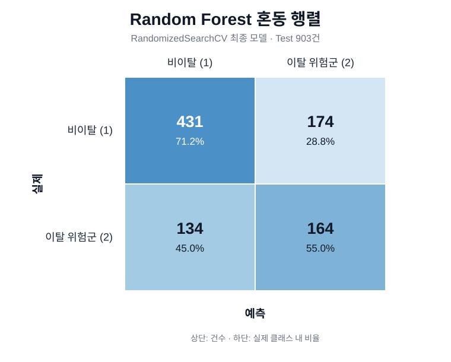
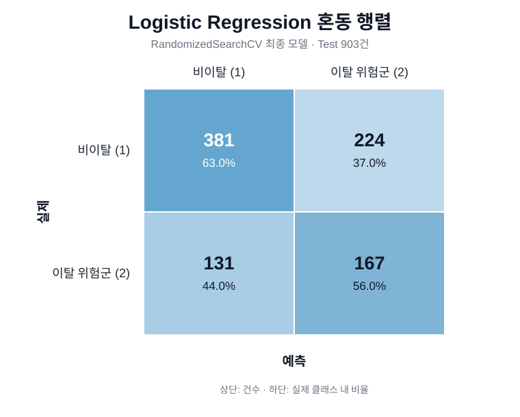
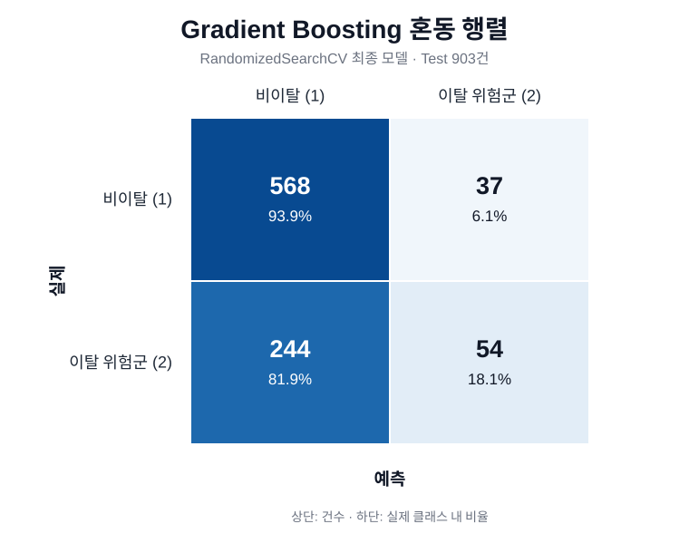
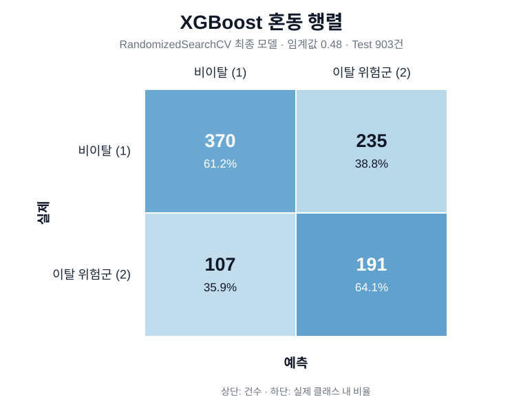
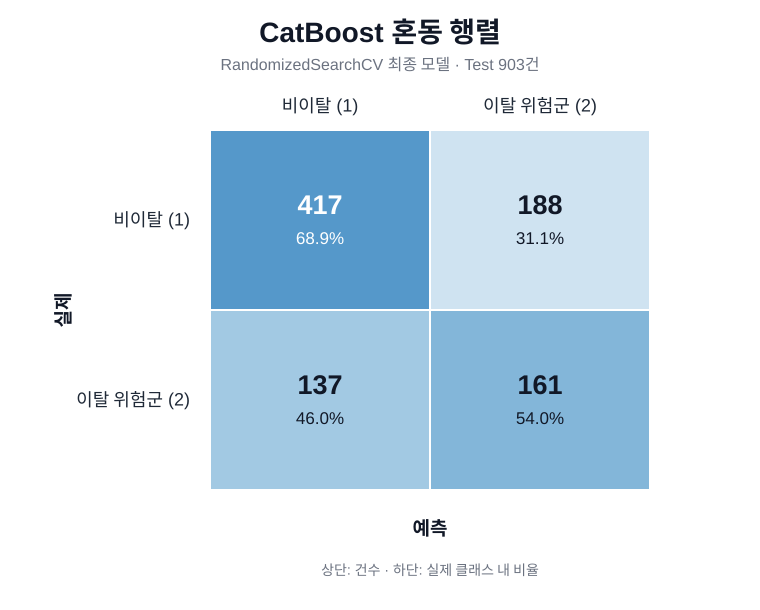
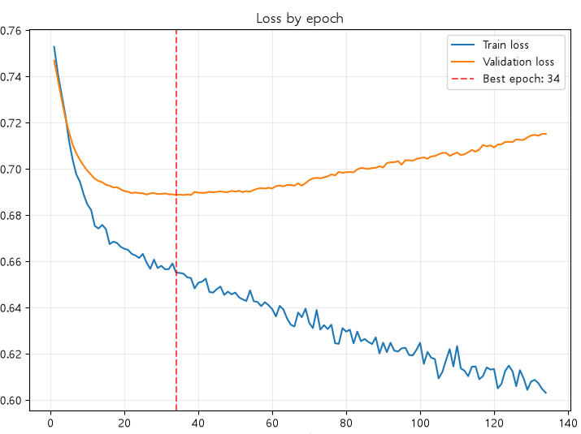
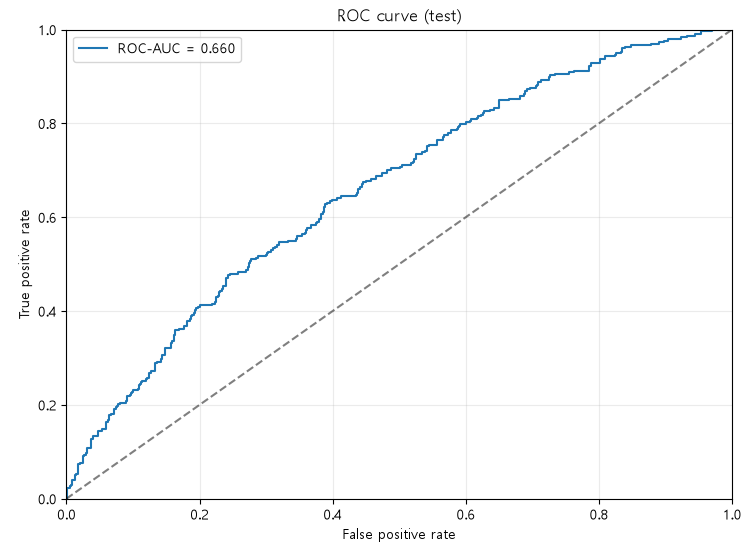
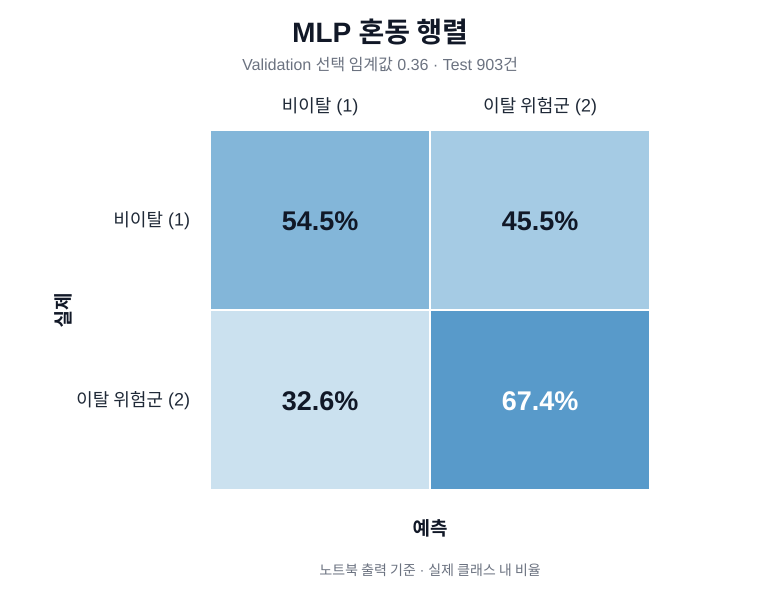

# 기부 중단 위험군 분류 모델 학습 결과서

## 1. 문서 목적

`기부여부(GUBUN)=1`(비이탈)과 `기부여부(GUBUN)=2`(이탈 위험군)를 분류한 모델의 학습 방법, 하이퍼파라미터 탐색 범위, 최적 설정과 성능을 정리한다.

학습 모델은 다음과 같다.

1. Random Forest
2. Logistic Regression
3. Gradient Boosting
4. XGBoost
5. CatBoost
6. Deep Learning (MLP)

## 2. 공통 학습 데이터와 평가 방식

### 2.1 학습 데이터

아래 공통 설정은 기존 머신러닝 5개 모델 기준이다. MLP는 Validation 데이터를 별도로 분리하고 스케일링을 적용했으며 8절에 정리한다.

| 항목 | 설정 |
|---|---|
| 전체 모델링 데이터 | 4,514건 |
| 입력 특성 | 27개 |
| 타겟 | `기부여부(GUBUN)` |
| Train | 3,611건 (`기부여부(GUBUN)=1`: 2,418, `기부여부(GUBUN)=2`: 1,193) |
| Test | 903건 (`기부여부(GUBUN)=1`: 605, `기부여부(GUBUN)=2`: 298) |
| 분리 방식 | `test_size=0.2`, `stratify=y`, `random_state=88` |
| 스케일링 | 미적용 |
| 오버샘플링·언더샘플링 | 미적용 |

### 2.2 하이퍼파라미터 탐색

머신러닝 튜닝 모델의 공통 설정은 다음과 같다.

| 항목 | 설정 |
|---|---|
| 탐색 방식 | `RandomizedSearchCV` |
| 탐색 횟수 | `n_iter=20` |
| 교차검증 | `StratifiedKFold(n_splits=5, shuffle=True, random_state=88)` |
| 주요 선정 지표 | `scoring='f1_macro'` |
| 병렬 처리 | 탐색기에 `n_jobs=-1` |
| 난수 시드 | 88 |

Random Forest의 GridSearchCV는 Accuracy와 `기부여부(GUBUN)=2` Recall을 함께 계산했다. 최고 Accuracy에서 0.03 이내인 후보 중 `기부여부(GUBUN)=2` Recall이 가장 높은 조합을 선택했다.

### 2.3 평가 지표

| 지표 | 활용 목적 |
|---|---|
| Accuracy | 전체 예측 정답 비율 확인 |
| Precision | 이탈 위험군으로 예측한 대상의 정확도 확인 |
| `기부여부(GUBUN)=2` Recall | 실제 이탈 위험군을 얼마나 많이 탐지했는지 확인 |
| F1-score | Precision과 Recall의 균형 확인 |
| Macro F1 | 두 클래스를 같은 비중으로 평가 |
| Confusion Matrix | 클래스별 오분류 패턴 확인 |

## 3. Random Forest 최적화 모델 비교

### 3.1 GridSearchCV 최적화

| 파라미터 | 탐색 범위 |
|---|---|
| `n_estimators` | 100, 200 |
| `max_depth` | 2, 3, 5, 10 |
| `min_samples_split` | 2, 3, 5 |
| `min_samples_leaf` | 1, 5, 8 |
| `class_weight` | `None`, `balanced`, `balanced_subsample`, `{1:1, 2:2}`, `{1:1, 2:2.5}`, `{1:1, 2:3}` |

432개 조합을 5겹 교차검증해 총 2,160회 학습했다.

| 최적 파라미터 | 선택값 |
|---|---|
| `n_estimators` | 100 |
| `max_depth` | 10 |
| `min_samples_split` | 3 |
| `min_samples_leaf` | 1 |
| `class_weight` | `None` |

| CV 지표 | 결과 |
|---|---:|
| Accuracy | 0.6876 |
| `기부여부(GUBUN)=2` Recall | 0.1853 |

| 데이터 | Accuracy | Macro Precision | Macro Recall | Macro F1 | `기부여부(GUBUN)=2` Precision | `기부여부(GUBUN)=2` Recall | `기부여부(GUBUN)=2` F1 |
|---|---:|---:|---:|---:|---:|---:|---:|
| Train | 0.80 | 0.86 | 0.70 | 0.72 | 0.94 | 0.40 | 0.57 |
| Test | 0.6899 | 0.66 | 0.55 | 0.53 | 0.62 | 0.16 | 0.25 |

### 3.2 RandomizedSearchCV 최적화

클래스 가중치 후보를 `balanced`와 `balanced_subsample`로 제한하고, Macro F1 기준으로 20개 조합을 탐색했다.

| 파라미터 | 탐색 범위 |
|---|---|
| `n_estimators` | 100, 200 |
| `max_depth` | 2, 3, 5, 10 |
| `min_samples_split` | 2, 3, 5 |
| `min_samples_leaf` | 1, 5, 8 |
| `class_weight` | `balanced`, `balanced_subsample` |

| 최적 파라미터 | 선택값 |
|---|---|
| `n_estimators` | 200 |
| `max_depth` | 10 |
| `min_samples_split` | 3 |
| `min_samples_leaf` | 1 |
| `class_weight` | `balanced` |

| 데이터 | Accuracy | Macro Precision | Macro Recall | Macro F1 | `기부여부(GUBUN)=2` Precision | `기부여부(GUBUN)=2` Recall | `기부여부(GUBUN)=2` F1 |
|---|---:|---:|---:|---:|---:|---:|---:|
| Train | 0.81 | 0.79 | 0.82 | 0.80 | 0.65 | 0.88 | 0.75 |
| Test | 0.6589 | 0.62 | 0.63 | 0.63 | 0.49 | 0.55 | 0.52 |

**혼동 행렬**

### 3.3 최종 모델 선택

| 구분 | GridSearchCV | RandomizedSearchCV |
|---|---:|---:|
| 탐색 조합 | 432개 | 20개 |
| 5겹 교차검증 기준 총 학습 횟수 | 2,160회 | 100회 |
| Test `기부여부(GUBUN)=2` Recall | 0.16 | 0.55 |

GridSearchCV는 432개 조합 × 5겹 교차검증으로 총 2,160회 학습했고, Test `기부여부(GUBUN)=2` Recall은 0.16이었다. RandomizedSearchCV는 20개 조합 × 5겹 교차검증으로 총 100회 학습했고, Test `기부여부(GUBUN)=2` Recall은 0.55였다.

RandomizedSearchCV는 GridSearchCV보다 훨씬 적은 탐색 횟수로 더 높은 이탈 위험군 Recall을 기록했다. 탐색 횟수 기준의 시간 대비 성능과 핵심 목표인 이탈 위험군 탐지 성능을 고려해 RandomizedSearchCV 모델을 최종 Random Forest로 선택했다.

## 4. Logistic Regression

Logistic Regression은 선형 결정 경계를 사용하는 비교 모델이다. 별도 스케일링은 적용하지 않았다.

| 파라미터 | 탐색 범위 |
|---|---|
| `C` | `np.logspace(-3, 3, 30)` |
| `penalty` | `l1`, `l2` |
| `solver` | `liblinear` |
| `class_weight` | `None`, `balanced` |
| `max_iter` | 1,000, 2,000, 3,000 |

| 최적 파라미터 | 선택값 |
|---|---|
| `C` | 0.02807216203941177 |
| `penalty` | `l2` |
| `solver` | `liblinear` |
| `class_weight` | `balanced` |
| `max_iter` | 2,000 |

| 데이터 | Accuracy | Macro Precision | Macro Recall | Macro F1 | `기부여부(GUBUN)=2` Precision | `기부여부(GUBUN)=2` Recall | `기부여부(GUBUN)=2` F1 |
|---|---:|---:|---:|---:|---:|---:|---:|
| Train | 0.63 | 0.62 | 0.63 | 0.61 | 0.46 | 0.65 | 0.53 |
| Test | 0.6069 | 0.59 | 0.60 | 0.58 | 0.43 | 0.56 | 0.48 |

**혼동 행렬**

## 5. Gradient Boosting

Gradient Boosting은 약학습기를 순차적으로 학습한다. 트리 수·학습률·깊이·샘플링·조기 종료 파라미터를 탐색했다.

| 파라미터 | 탐색 범위 |
|---|---|
| `n_estimators` | 50, 100, 150 |
| `learning_rate` | 0.01, 0.03, 0.05, 0.1 |
| `max_depth` | 1, 2, 3 |
| `min_samples_split` | 10, 20, 30, 50 |
| `min_samples_leaf` | 5, 10, 20, 30 |
| `subsample` | 0.6, 0.7, 0.8, 0.9 |
| `max_features` | `sqrt`, `log2`, 0.5 |
| `n_iter_no_change` | 5, 10 |
| `validation_fraction` | 0.1, 0.2 |

| 최적 파라미터 | 선택값 |
|---|---|
| `n_estimators` | 150 |
| `learning_rate` | 0.1 |
| `max_depth` | 3 |
| `min_samples_split` | 20 |
| `min_samples_leaf` | 20 |
| `subsample` | 0.6 |
| `max_features` | `log2` |
| `n_iter_no_change` | 10 |
| `validation_fraction` | 0.1 |

| 데이터 | Accuracy | Macro Precision | Macro Recall | Macro F1 | `기부여부(GUBUN)=2` Precision | `기부여부(GUBUN)=2` Recall | `기부여부(GUBUN)=2` F1 |
|---|---:|---:|---:|---:|---:|---:|---:|
| Train | 0.70 | 0.68 | 0.58 | 0.56 | 0.65 | 0.21 | 0.31 |
| Test | 0.6888 | 0.65 | 0.56 | 0.54 | 0.59 | 0.18 | 0.28 |

**혼동 행렬**

## 6. XGBoost

XGBoost는 학습 전에 `기부여부(GUBUN)=1`을 0, `기부여부(GUBUN)=2`를 1로 변환했다. Train 클래스 비율은 `2,418 / 1,193 = 2.0268`이다. 해당 비율을 `scale_pos_weight` 후보에 반영했다.

### 6.1 학습 설정 및 결과

| 기본 설정 | 설정값 |
|---|---|
| `objective` | `binary:logistic` |
| `eval_metric` | `logloss` |
| `tree_method` | `hist` |
| `random_state` | 88 |
| 모델 `n_jobs` | 1 |

| 파라미터 | 탐색 범위 |
|---|---|
| `n_estimators` | 100, 200, 300 |
| `learning_rate` | 0.03, 0.05, 0.1 |
| `max_depth` | 2, 3, 4 |
| `min_child_weight` | 1, 3, 5 |
| `subsample` | 0.7, 0.85, 1.0 |
| `scale_pos_weight` | 1.0, 2.0268, 3.0402 |

| 최적 파라미터 | 선택값 |
|---|---|
| `n_estimators` | 200 |
| `learning_rate` | 0.05 |
| `max_depth` | 2 |
| `min_child_weight` | 3 |
| `subsample` | 0.85 |
| `scale_pos_weight` | 2.0268231349538977 |

| 항목 | 결과 |
|---|---:|
| 최종 확률 임계값 | 0.48 |

| 데이터 | Accuracy | Macro Precision | Macro Recall | Macro F1 | `기부여부(GUBUN)=2` Precision | `기부여부(GUBUN)=2` Recall | `기부여부(GUBUN)=2` F1 |
|---|---:|---:|---:|---:|---:|---:|---:|
| Train | 0.64 | 0.64 | 0.66 | 0.63 | 0.47 | 0.73 | 0.57 |
| Test | 0.6213 | 0.61 | 0.63 | 0.61 | 0.45 | 0.64 | 0.53 |

**혼동 행렬**

## 7. CatBoost

CatBoost는 자동 클래스 가중치를 적용하고 트리 구조와 규제 파라미터를 탐색했다.

| 기본 설정 | 설정값 |
|---|---|
| `loss_function` | `Logloss` |
| `eval_metric` | `F1` |
| `auto_class_weights` | `Balanced` |
| `random_seed` | 88 |
| `verbose` | 0 |

| 파라미터 | 탐색 범위 |
|---|---|
| `iterations` | 100, 200, 300, 500 |
| `depth` | 3, 4, 5, 6 |
| `learning_rate` | 0.01, 0.03, 0.05, 0.1 |
| `l2_leaf_reg` | 1, 3, 5, 10 |
| `random_strength` | 0.5, 1, 2, 5 |
| `border_count` | 32, 64, 128 |

`RandomizedSearchCV`로 20개 조합을 5겹 층화 교차검증했다. 선정 지표는 Macro F1이다.

| 최적 파라미터 | 선택값 |
|---|---|
| `iterations` | 300 |
| `depth` | 6 |
| `learning_rate` | 0.03 |
| `l2_leaf_reg` | 1 |
| `random_strength` | 0.5 |
| `border_count` | 128 |

| 데이터 | Accuracy | Macro Precision | Macro Recall | Macro F1 | `기부여부(GUBUN)=2` Precision | `기부여부(GUBUN)=2` Recall | `기부여부(GUBUN)=2` F1 |
|---|---:|---:|---:|---:|---:|---:|---:|
| Train | 0.78 | 0.76 | 0.79 | 0.77 | 0.62 | 0.84 | 0.71 |
| Test | 0.64 | 0.61 | 0.61 | 0.61 | 0.46 | 0.54 | 0.50 |

**혼동 행렬**

## 8. Deep Learning (MLP)

PyTorch 기반 MLP를 학습했다. 별도 하이퍼파라미터 탐색은 사용하지 않고 설정값을 직접 지정했다.

### 8.1 데이터 분리와 스케일링

| 항목 | 설정 |
|---|---|
| 전체 모델링 데이터 | 4,514건 |
| 입력 특성 | 27개 |
| 타겟 변환 | `기부여부(GUBUN)=1` → 0, `기부여부(GUBUN)=2` → 1 |
| Train | 2,708건 |
| Validation | 903건 |
| Test | 903건 |
| 최종 분할 비율 | 60:20:20 |
| 분리 방식 | 1차 Train·Validation/Test 80:20, 2차 Train/Validation 75:25 |
| 층화 분리 | `stratify` 적용 |
| 스케일링 | Train으로 `StandardScaler` 학습 후 Validation·Test에 동일 적용 |
| 텐서 자료형 | `float32` |

### 8.2 모델 구조와 학습 설정

| 항목 | 설정 |
|---|---|
| 프레임워크 | PyTorch |
| 모델 | 다층 퍼셉트론(MLP) |
| 입력층 | 27개 |
| 은닉층 | 32개, 16개 |
| 활성화 함수 | `ReLU` |
| Dropout | 각 은닉층 뒤 0.1 |
| 출력층 | 이진분류 logit 1개 |

| 항목 | 설정 |
|---|---|
| 손실 함수 | `BCEWithLogitsLoss(pos_weight=1.2564)` |
| 원래 이탈 클래스 가중치 | 2.0257 |
| 가중치 반영 강도 | 25% |
| Optimizer | Adam |
| Batch size | 64 |
| Learning rate | `3e-4` |
| Weight decay | `1e-5` |
| 최대 Epoch | 10,000 |
| Early Stopping 기준 | Validation Loss |
| Early Stopping patience | 100 |
| 학습 종료 Epoch | 126 |
| 최적 가중치 Epoch |  |
| 최종 가중치 | 최저 Validation Loss 시점의 가중치 복원 |

**학습·검증 Loss**

### 8.3 분류 임계값과 평가 결과

Validation 데이터에서 목표 Recall을 충족하는 후보 중 Accuracy가 가장 높은 임계값을 선택했다.

| 항목 | 결과 |
|---|---:|
| 임계값 후보 | 0.10~0.90, 0.01 간격 |
| 목표 Validation `기부여부(GUBUN)=2` Recall | 0.68 |
| 선택 임계값 | 0.36 |
| Validation Accuracy | 0.5891 |
| Validation `기부여부(GUBUN)=2` Recall | 0.6946 |

| 데이터 | Accuracy | Macro Precision | Macro Recall | Macro F1 | `기부여부(GUBUN)=2` Precision | `기부여부(GUBUN)=2` Recall | `기부여부(GUBUN)=2` F1 |
|---|---:|---:|---:|---:|---:|---:|---:|
| Train | 0.6377 | 0.6400	| 0.6580 | 0.6251 | 0.4654 | 0.7296 | 0.5683 |
| Validation | 0.5891 | 0.6078 | 0.6216 | 0.5912|0.4331| 0.6946 | 0.5306 |
| Test | 0.5880 | 0.6015 | 0.6147 | 0.5921 | 0.4223 | 0.6745 | 0.5194 |

| Test 추가 지표 | 결과 |
|---|---:|
| Loss | 0.6892 |
| ROC-AUC | 0.6583 |

**ROC 곡선**

**혼동 행렬**

## 9. 모델 성능 비교

머신러닝 5개 모델은 시간대비 성능이 우수한 RandomizedSearchCV로 최적화했다. MLP는 Validation 데이터와 Early Stopping을 사용해 학습했다.

| 모델 | Test Accuracy | Test Macro F1 | `기부여부(GUBUN)=2` Precision | `기부여부(GUBUN)=2` Recall | `기부여부(GUBUN)=2` F1 |
|---|---:|---:|---:|---:|---:|
| Random Forest | 0.6589 | 0.63 | 0.49 | 0.55 | 0.52 |
| Logistic Regression | 0.6069 | 0.58 | 0.43 | 0.56 | 0.48 |
| Gradient Boosting | 0.6888 | 0.54 | 0.59 | 0.18 | 0.28 |
| XGBoost | 0.6213 | 0.61 | 0.45 | 0.64 | 0.53 |
| CatBoost |0.64 | 0.61 | 0.46 | 0.54 | 0.50 |
| MLP | 0.5880 | 0.5921 | 0.4223 | 0.6745 | 0.5194 |

- Test Macro F1이 출력된 모델 중 Random Forest가 0.63으로 가장 높았다.
- MLP의 `기부여부(GUBUN)=2` Recall은 0.6745였다. 기존 머신러닝 모델과 Test 분할 시드는 다르다.
- CatBoost는 Test Macro F1 0.61, `기부여부(GUBUN)=2` Recall 0.54를 기록했다.
